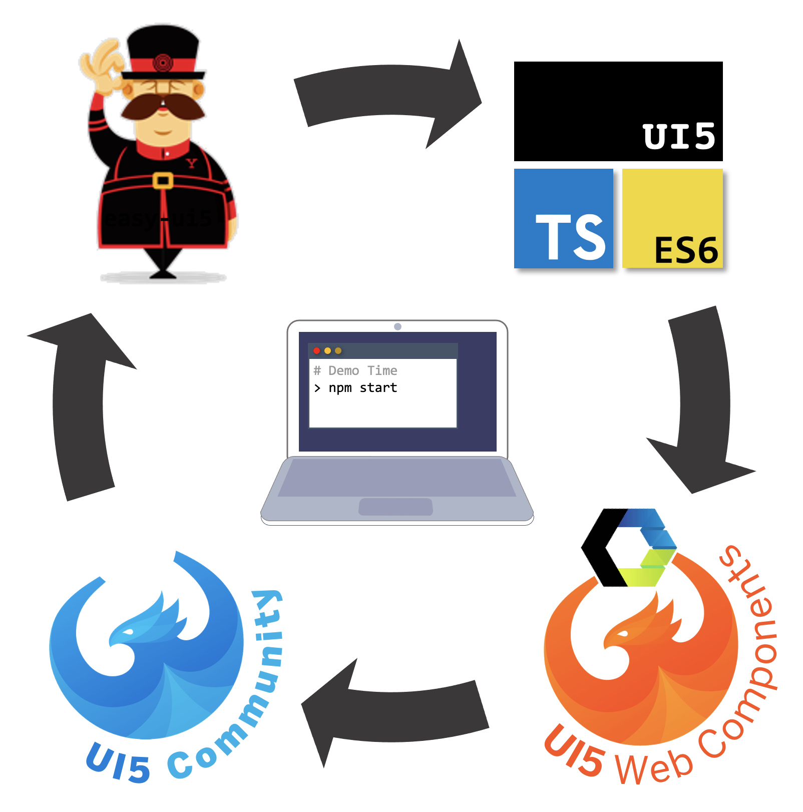

# UI5 Web Component Enablement

This project shows the usage of the UI5 Web Components wrapper controls in OpenUI5. It uses the UI5 tooling to serve the UI5 libraries and makes use of the UI5 TypeScript support to create the application. Within the application, the wrapper controls are used in an `XMLView` and the corresponding controller.



The project is based on the Yeoman generator easy-ui5 to kick-start your TypeScript UI5 application. All different pieces play well together: the Easy-UI5 generator, the UI5 Community templates, the OpenUI5 programming model, TypeScript, and most important here the UI5 Web Components inside OpenUI5.

## Requirements

Either [npm](https://www.npmjs.com/) or [yarn](https://yarnpkg.com/) for dependency management.

## Preparation

Use `npm` (or `yarn`) to install the dependencies:

```sh
npm i
```

(To use yarn, just do `yarn` instead.)

## Run the App

Execute the following command to run the app locally for development in watch mode (the browser reloads the app automatically when there are changes in the source code):

```sh
npm start
```

As shown in the terminal after executing this command, the app is then running on http://localhost:8080/index.html. A browser window with this URL should automatically open.

(When using yarn, do `yarn start` instead.)

## Build the App

### Unoptimized (but quick)

Execute the following command to build the project and get an app that can be deployed:

```sh
npm run build
```

The result is placed into the `dist` folder. To start the generated package, just run

```sh
npm run start:dist
```

Note that `index.html` still loads the UI5 framework from the relative URL `resources/...`, which does not physically exist, but is only provided dynamically by the UI5 tooling. So for an actual deployment you should change this URL to either [the CDN](https://openui5.hana.ondemand.com/#/topic/2d3eb2f322ea4a82983c1c62a33ec4ae) or your local deployment of UI5.

(When using yarn, do `yarn build` and `yarn start:dist` instead.)

### Optimized

For an optimized self-contained build (takes longer because the UI5 resources are built, too), do:

```sh
npm run build:opt
```

To start the generated package, again just run:

```sh
npm run start:dist
```

In this case, all UI5 framework resources are also available within the `dist` folder, so the folder can be deployed as-is to any static web server, without changing the bootstrap URL.

With the self-contained build, the bootstrap URL in `index.html` has already been modified to load the newly created `sap-ui-custom.js` for bootstrapping, which contains all app resources as well as all needed UI5 JavaScript resources. Most UI5 resources inside the `dist` folder are for this reason actually **not** needed to run the app. Only the non-JS-files, like translation texts and CSS files, are used and must also be deployed. (Only when for some reason JS files are missing from the optimized self-contained bundle, they are also loaded separately.)

(When using yarn, do `yarn build:opt` and `yarn start:dist` instead.)

## Check the Code

Do the following to run a TypeScript check:

```sh
npm run ts-typecheck
```

This checks the application code for any type errors (but will also complain in case of fundamental syntax issues which break the parsing).

To lint the TypeScript code, do:

```sh
npm run lint
```

(Again, when using yarn, do `yarn ts-typecheck` and `yarn lint` instead.)

## References

Once you have understood the setup and want to inspect the code of a slightly more comprehensive UI5 app written in TypeScript, you can check out the [TypeScript version of the UI5 CAP Event App Sample](https://github.com/SAP-samples/ui5-cap-event-app/tree/typescript).

## License

This project is licensed under the Apache Software License, version 2.0 except as noted otherwise in the [LICENSE](LICENSE) file.
